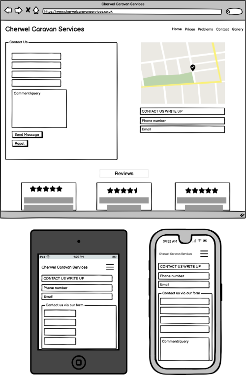
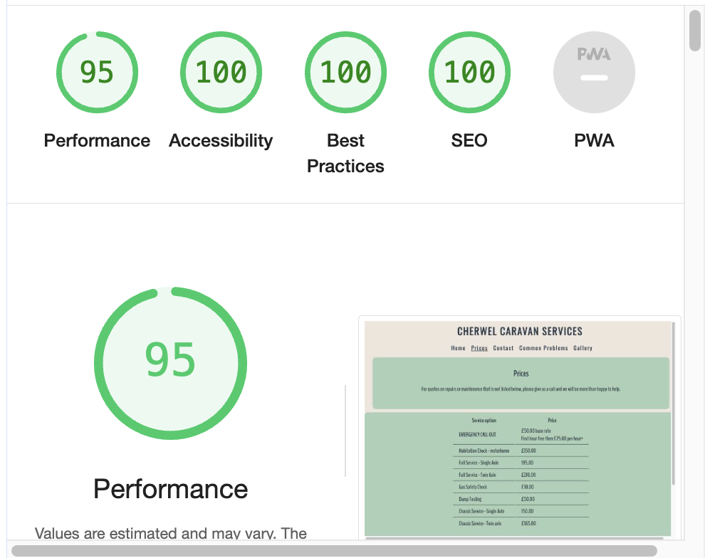
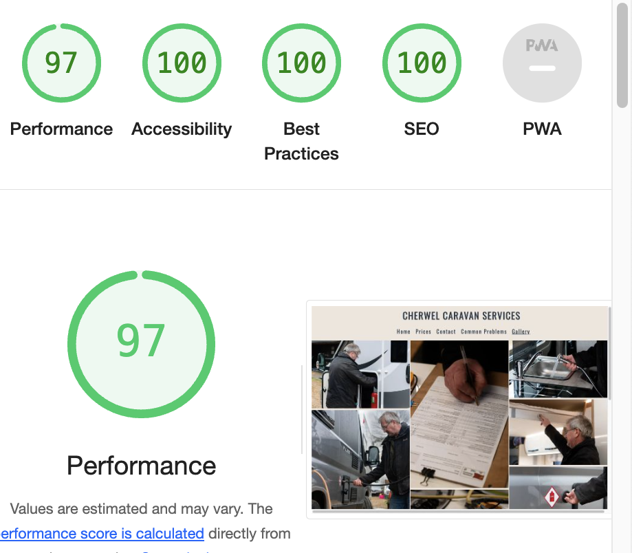

# Cherwel Caravan Services

This website is designed to be responsive on a range of devices. Cherwel Caravan Services website allows current and potential future customers to find out what services are offered and the cost of these. It also allows customers to contat the business owner with any questions or queries they may have. 

[Cherwel Caravan Services is available to view on Github pages](https://sarahwelcher.github.io/cherwelcaravanservices/)
***

## Table of Contents

 - [User Experience (UX)](#user-experience-ux)
  - [Key Information](#key-information)
  - [Client Goals](#client-goals)
- [Design](#design)
  - [Wireframes](#wireframes)
  - [Colors](#colors)
  - [Typography](#typography)
  - [Images](#images)
  - [Accessibility](#accessibility)
  - [Structure](#structure)
    - [Homepage](#homepage)
    - [Prices](#prices)
    - [Contact](#contact)
    - [Common problems](#common-problems)
    - [Gallery](#gallery)
- [Features](#features)
  - [Future Features](#future-features)
- [Technology Used](#technology-used)
- [Testing](#testing)
  - [W3 Validator results](#w3-validator-results)
  - [Jigsaw results](#jigsaw-results)
  - [Other Testing](#other-testing)
  - [Lighthouse Results](lighthouse-results)
    - [Mobile](#mobile)
    - [Desktop](desktop)
- [Bugs \& Issues](#bugs--issues)
  - [Solved bugs](#solved-bugs)
  - [Unresolved issues](#unresolved-issues)
- [Deployment](#deployment)
  - [How to fork](#how-to-fork)
  - [How to clone](#how-to-clone)
- [Credits](#credits)
- [Acknowledgements](#acknowledgements)

***

### Key Information

- What service/repair/maintenance options Cherwel Caravan Services offer.
- What prices these services are offered at.
- How much emergency call out costs approximately.
- A clear way of contacting Cherwel Caravan Services to discuss caravan issues, queries, or to book in for work to be completed.

### Client Goals

- To have a responsive website for different screen sizes.
- To provide information to new and current customers showing what services are avaiable to them.
- To provide price information to new and current customers for any work that has a set cost.
-  To increase customer base.
-  To allow new and current customers to easily contact Cherwel Caravan Services with any questions or booking enquiries.
***

## Design

### Wireframes 

Basic wireframes were created for mobile, tablet and desktop using Balsamiq.

Homepage Wireframe

Prices wireframe

Contact wireframe

Common Problems wireframe

Gallery

### Colors

The company does not have an official logo. A dark blue/grey was used as a starting point for the coolers color generator (based on an old business card that was used previously), which came up with a pallet consisting of earthy tones. Blue represents loyalty, reliability and confidence, and the earthy tones signify nature; customers often visit places of natural beauty when using their caravans for holidays or short breaks. 
The color palette was created using [Coolors](https://www.coolors.co/). 

### Typography

Google fonts was used to select the typography used within the website. BenchNine was primarly used across the site, with Oswald for logo and navigation bar, and sans-serif as fall back.

### Images

Most images used within the website were photographed and edited by myself, however I did use images of company logos from outside sources to link registered profile (credited below), as well as icons from FontAwesome.

### Accessibility

I have attempted to make the website as accessible as possible by using colors that contrast well, using semantic HTML and using descriptive alt attributes on images.
I have provided descriptions where icons are used to allow screen readers to read these.

### Structure

#### Homepage 

The homepage was designed to give ease of access to key information to prevent users having to search the website for what they need, providing a good user experience. The homepage therefore shows a list of services provided with a link to more information, which can be found within the prices page.

#### Prices

The prices page shows the set prices of certain service and maintenance options. The prices page also shows a call out cost and explains that quotes can be given for repair work as these do not generally have a set cost.

#### Contact 

The contact page has key information showing how to contat Cherwel Caravan Services, as well as a form they can fill out within the website if they would prefer not to call or use an external email system. The contact page also shows recent reviews from customers below contact information so any potential new customers who were looking to contact the service, can see what other customers think.

#### Common problems

This page was placed after the contact page, as users are able to call the engineer to talk them through any issues they may be able to fix themselves, but the option to use a written walkthrough was still important to add to the website.

#### Gallery

This page shows some images of recent work being carried out.

***

## Features

- This website is targeting people who require a service or repair on their caravan.
- They are able to check service options, prices, and contact the company via email, phone or contact form. They can also check reviews.
- Responsive on all device sizes.

### Nav

- Logo and navigation bar is featured on all pages.
- Includes links to all pages, as well as logo linking back to homepage. 
- Nav moves below logo on smaller device screens.
- Allows users to easily navigate website.

Navigation

### Hero image

- Includes overlay text with a contact button that links to contact page.
- Only shown on homepage.

Hero image and overlay text

### Service option grid

- Shows the main service, repair and maintenance options available.
- Has a short description of the service option.
- On tablet screens, some options are hidden. 
- On mobile screens, some options are hidden along with all descriptions.

Service option grid

### About us section

- Allows users to understand how Cherwel Caravan Services was started and who runs it. 
- Shows a portrait of the owner of the company.

About us

### Footer

- Allows users to visit the company facebook page, and the registered profiles on the Mobile Caravan Engineers Association website, and Gas Safety Register website.
- Fixed at bottom of all pages.

Footer

### Prices

- Allows users to find out how much service options cost.  
- Shows users that the price of parts is not included.
- Allows users to check emergency call out cost.

Prices

### Contact form

- Allows users to contact Cherwel Caravan Services.
- Submits to a thank you page stating that the information does not actually go anywhere currently. 
- Has a reset form button

Form

Thank you page

### Contact details

- Shows contact details that customers can use if they choose not to use the form. 

Contact details

### Reviews

- Allows users to check the 3 most recent reviews.
- Reviews are at the bottom of the contact page, and stack on smaller screens.

Reviews

### Common Problems

- Assists customers to try and fix minor issues themselves before they have to consider a call out fee or repair fee.
- Explains that the company are happy to try and assist over the phone if necessary before booking a call out.
- Features a video explaining a common fridge issue.
- Video has subtitles and the text below also repeats video content for accessibility.

Common problems

### Gallery

- Shows images of recent work carried out by Paul, the owner of Cherwel Caravan Services.

Gallery

### Future Features

In future, I would like to add in a calendar that can be used to book a service in whilst on the website.
I would also like to add a 'pay invoice' page where users are able to input the invoice number and some security details (surname & postcode, to clarify the correct invoice number was inputted) to allow them to pay their bill online.

***

## Technology Used

- HTML and CSS was used to create the website
- Gitpod & Gitub
- All wireframes were created using [Balsamiq](https://balsamiq.com/)  
- All icons used across the website were found on [Font Awesome](https://fontawesome.com/icons)
- [Google fonts](https://fonts.google.com/) was used for all typography
- [amiresponsive](https://ui.dev/amiresponsive) was used for the mock ups

***

## Testing

### W3 Validator results

index.html

prices.html

contact.html

problems.html

gallery.html

thank-you.html

### Jigsaw Results

### Other Testing
- Viewed on an Iphone 14 Pro using Safari & 13inch macbook pro using both Chrome and Safari, amazon fire tablet using Silk browser and a larger desktop monitor using Chrome. 
- Links between pages were all working throughout the coding process.
- Chrome dev tools was used throughout to check responsiveness.

### Lighthouse Results

#### Mobile

Homepage

Prices

Contact

Common Problems

Gallery

Thank you page

#### Desktop

Homepage

Prices

Contact

Common Problems

Gallery

Thank you page

***

## Bugs & Issues

### Solved bugs

- 
-

### Unresolved issues

- Mobile view - Have to zoom out slightly on each page so the page sits at 100% width. 

***

## Deployment

GitHub Pages used to deploy live version of the website.

- Log in to GitHub and locate GitHub Repository Cherwel Caravan Services
- At the top of the Repository click settings
- Scroll down the settings page and click on pages (found on the left)
- Under "Source", select 'deploy from a branch' from the dropdown menu
- Under "branch", check that "main" is selected
- Save and refresh to get the link to deployed site (could take up to 10 minutes)

### How to fork

- Log in to GitHub and locate GitHub Repository Cherwel Caravan Services
- In the top right corner of the page, click fork
- Under "Owner," select the dropdown menu and click an owner for the forked repository.
- By default, forks are named the same as their upstream repositories. Optionally, to further distinguish your fork, in the "Repository name" field, type a name.
- Optionally, in the "Description" field, type a description of your fork.
- Optionally, select Copy the DEFAULT branch only.
- For many forking scenarios, such as contributing to open-source projects, you only need to copy the default branch. If you do not select this option, all branches will be copied into the new fork.
- Click Create fork.

### How to clone

- On GitHub.com, navigate to the main page of the repository.
- Above the list of files, click  Code.
- Copy the URL for the repository.
  - To clone the repository using HTTPS, under "HTTPS", click the clipboard icon.
  - To clone the repository using an SSH key, including a certificate issued by your organization's SSH certificate authority, click SSH, then click the clipboard icon .
  - To clone a repository using GitHub CLI, click GitHub CLI, then click copy icon .
- Open Terminal.
- Change the current working directory to the location where you want the cloned directory.
- Type git clone, and then paste the URL you copied earlier.
- Press Enter to create your local clone.

***

## Credits

- [Coolors contrast checker](https://coolors.co/contrast-checker/112a46-acc8e5)
- [Flexbox guide](https://css-tricks.com/snippets/css/a-guide-to-flexbox/)
- [Grid guide](https://css-tricks.com/snippets/css/complete-guide-grid/)

## Acknowledgements

- My Mentor Mitko Bachvarov.
- [MCEA website for the logo used in the footer, linking to Cherwel Caravan Services resgistered profile](https://www.mobilecaravanengineers.co.uk/)
- [Gas Safe Register logo, also used in the footer and linking to the bucompanies registered profile](https://www.gassaferegister.co.uk/)
- Kera Cudmore - for her readme.md presentation which was a big help in writing my first readme.
- Phil Whitty on Slack for his help with the hero image, and general encouragement.